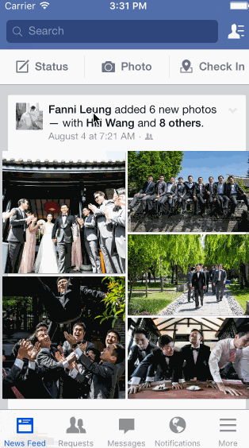

## Facebook

The purpose of this homework is to leverage animations and gestures to transition between screens. We're going to use the techniques from this week to implement some interactions in Facebook.

Time spent: `8`

### Features

#### Required

- [x] Tapping on a photo in the news feed should expand the photo full screen.
- [x] Tapping the Done button should animate the photo back into its position in the news feed.
- [x] On scroll of the full screen photo, the background should start to become transparent, revealing the feed.
- [x] If the user scrolls a large amount and releases, the full screen photo should dismiss.

#### Optional

- [ ] The full screen photo should be zoomable.
- [ ] The user should be able to page through the other photos in full screen mode.

#### The following **additional** features are implemented:

- [ ] List anything else that you can get done to improve the app functionality!

Please list two areas of the assignment you'd like to **discuss further with your peers** during the next class (examples include better ways to implement something, how to extend your app in certain ways, etc):

1. For some reason, I couldn't get the custom dismiss to work properly. I used the same method as the presentTransition, but I kept getting a ton of errors :(
2. The new imageView doesn't quite come from the right position and when the modal finishes presenting, the image kind of skips. Did anyone else have this problem?

### Video Walkthrough 

Here's a walkthrough of implemented user stories:

GIF created with [LiceCap](http://www.cockos.com/licecap/).

## Notes

This was definitely the most challenging assignment. I had a hard time getting the custom transitions to display properly and still haven't quite figured it out.
* Any libraries or borrowed content.
